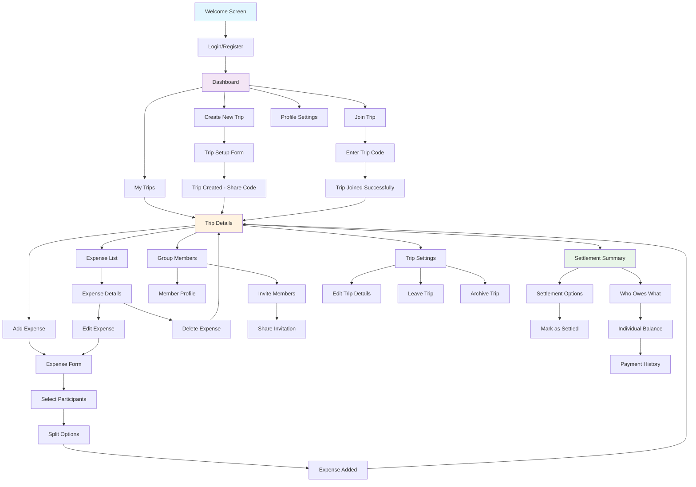

```mermaid
graph TD
    A[Welcome Screen] --> B[Login/Register]
    B --> C[Dashboard]
    
    C --> D[My Trips]
    C --> E[Create New Trip]
    C --> F[Join Trip]
    C --> G[Profile Settings]
    
    D --> H[Trip Details]
    E --> I[Trip Setup Form]
    F --> J[Enter Trip Code]
    
    I --> K[Trip Created - Share Code]
    J --> L[Trip Joined Successfully]
    K --> H
    L --> H
    
    H --> M[Add Expense]
    H --> N[Expense List]
    H --> O[Group Members]
    H --> P[Settlement Summary]
    H --> Q[Trip Settings]
    
    M --> R[Expense Form]
    R --> S[Select Participants]
    S --> T[Split Options]
    T --> U[Expense Added]
    U --> H
    
    N --> V[Expense Details]
    V --> W[Edit Expense]
    V --> X[Delete Expense]
    W --> R
    X --> H
    
    O --> Y[Invite Members]
    O --> Z[Member Profile]
    Y --> AA[Share Invitation]
    
    P --> BB[Who Owes What]
    P --> CC[Settlement Options]
    CC --> DD[Mark as Settled]
    
    Q --> EE[Edit Trip Details]
    Q --> FF[Leave Trip]
    Q --> GG[Archive Trip]
    
    BB --> HH[Individual Balance]
    HH --> II[Payment History]
    
    style A fill:#e1f5fe
    style C fill:#f3e5f5
    style H fill:#fff3e0
    style P fill:#e8f5e8
```